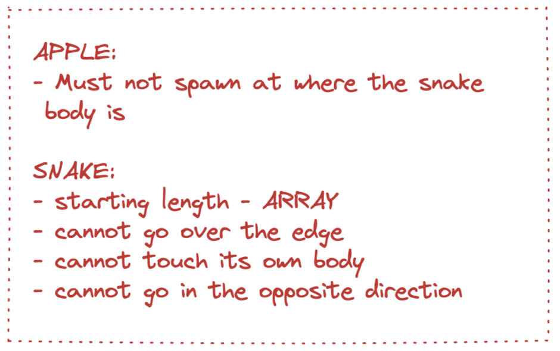
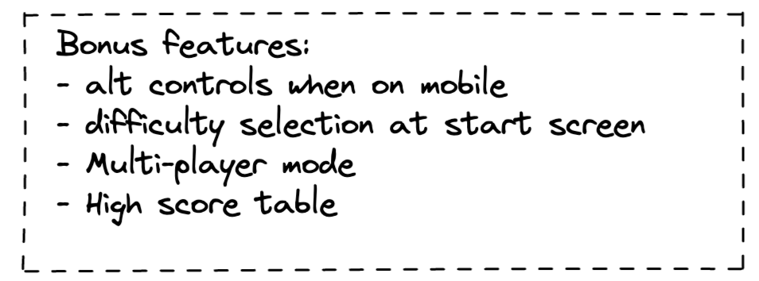

# GA PROJECT 01 - ALICE LO

## Project description

As the first project in the SEI course, we need to build a web game using JavaScript. I chose Snake Game as it was one of my favorite games when I was a kid, and I remember vividly playing this game on my mom's Nokia 8210. This has been a fun project to work on, and to polish and challenge my JavScript skills.

I dedicate this project to my mom and her white Nokia 8210 from 1999. :)

## Deploment link

https://siuusunn.github.io/ga-project-01/

## Getting Started/ Code Installation

<!-- NEED MORE INFO ON WHAT TO WRITE HERE -->

Instructions

Explain how the reader accesses your code. Include a step by step approach.

Insert your Getting Started/Code Installation here:

## Working Team & Timeframe

A solo project by Alice Lo (https://github.com/siuusunn).

Project brief was received on \_**\_ and started working on the project on \_\_**. MVP was finished on day 4.

## Technologies Used

Front End:

- HTML
- CSS
- JavaScript

Development Tools:

- Visual Code Studio

Other Tools:

- Adobe Photoshop
- Sketch.io
- Excalidraw

## Brief

Build a snake game with the three key requirements below:

- The snake should be able to eat the apple and grow longer
- The snake speeds up as it eats more apples
- The game should end when the snake hits the wall or itself

<!-- Extra enhancements:

- Player should be able to choose difficulty
- A high score table to record previous high scores
- Responsive design for mobile users -->

## Planning

All my planning for this project were either drawn or written out on Excalidraw.

My first step of planning was to list out all the features that the MVP should have:

And then I listed out the important mechanics of the moving elements in the game. If these boxes are not ticked, the game will break:

I also drew a very simple wireframe to represent the layout I had in mind (mimicking a phone) which helped me think of what elements to use in the HTML:

And listed all the functions that I would need for the MVP:

Lastly, some bonus features!

---

## Code Process

I broke down the development into four main pieces and work on them one at a time:

1. The grid where the game operates on
2. The apple
3. The snake
4. Eating the apple

---

### The Grid

The is the easiest piece in code process. I first created a `div` called `grid` to contain the cells in the HTML. As I wanted to create a 10x10 game board, in JavaScript, I declared a `width` variable with the value of 10, a `gridCellCount` variable with the value of width \* width, and an empty array called `cells`.

Then in the `createGrid` function, a `for` loop creates 100 `div` each with its own unique `data id`. These are then pushed in the `cells` array and placed inside the `grid`.

---

### The Apple

The apple functions can be broken down into three parts:

1. Randomizing the apple position
2. Adding the apple
3. Removing the apple

First thing was to declare an `applePosition` variable and set it to `0`. And in the CSS, I set the `background-color` of class `apple` to red.

Then I wrote a `getRandomPosition` function to generate a random number within `gridCellCount` which is 100.

And then two similar functions to add and remove the apple. Using the number generated from `getRandomPosition`, these two functions will add and remove `apple` from the class list.

To wrap everything up, a final function for the apple is created called `spawnApple` which first remove the apple from its current position, get a random position, and then add the apple in the new position.

(At this point, `getRandomPosition` doesn't check whether the position it generated contains the snake body.)

---

### The snake

The snake is the most complicated piece in the development. I broke it down into several parts:

1. Rendering and removing the snake

First step is to declare `snake` as an array so that it can be extended when it eats an apple. (For testing purposes, I put `[2, 1, 0]` in the array) And in the CSS, `background-color` of the class `snake` is set to black.

To create the snake (and remove) on the game board, two simple functions using `forEach` method are used. A class of `snake` will be added to the corresponding cell, and vice versa.
